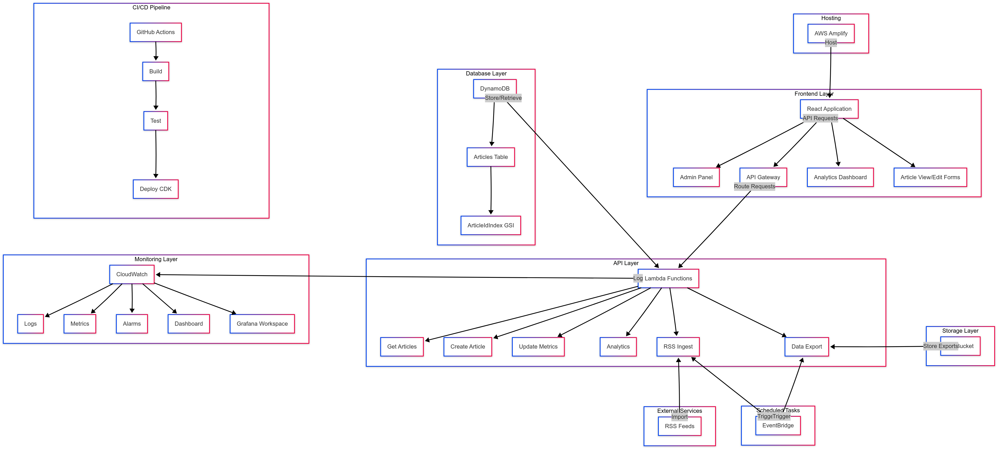
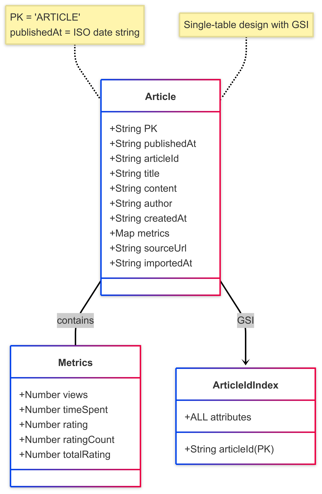

# Serverless News Platform

A scalable, serverless blog platform built with MERN stack (TypeScript) and AWS services that supports article publishing, user engagement tracking, and real-time analytics.

## Live Demo

The application is available at [https://wb-blog-platform.com](https://main.d24ldv2sph20ub.amplifyapp.com)

## Implementation Levels

| Area | Level | Description |
|------|-------|-------------|
| **Database** | L3 | Schema diagram for system entities + DynamoDB implementation on AWS + RSS integration for article import |
| **Backend/API** | L5 | Full API implementation with Swagger documentation, AWS deployment, unit testing, and a daily export job |
| **Cloud/DevOps** | L3 | System architecture diagram + Cloud infrastructure with AWS CDK + CI/CD pipeline with GitHub Actions |
| **Frontend** | L5 | Full web application hosted on AWS Amplify with both visualization views and data entry forms |
| **Monitoring** | L4 | CloudWatch dashboard and Grafana workspace with metrics for system components |

## Selected Challenge Implementation

**Multi-language Support**

The platform implements comprehensive internationalization with:
- Support for English, Hungarian, and Arabic languages
- RTL layout support for Arabic
- Automatic language detection based on browser settings
- Ability to manually switch between languages
- Translation files for all interface elements

## Architecture Overview



### Key Components

1. **Database Layer**
   - DynamoDB for storing articles, authors, and analytics data
   - Single-table design with GSIs for efficient queries
   - Partitioning strategy optimized for high-volume reads

2. **API Layer**
   - RESTful API built with AWS Lambda and API Gateway
   - Endpoints for article management, metrics, and analytics
   - Scheduled Lambda functions for maintenance tasks

3. **Frontend Layer**
   - React application with responsive design
   - Real-time analytics dashboards
   - Multi-language support
   - Admin control panel

4. **DevOps & Monitoring**
   - Infrastructure as Code using AWS CDK
   - CI/CD pipeline with GitHub Actions
   - CloudWatch metrics and alarms
   - Grafana dashboards for visualization

## Database Schema



### Main Table: Articles

| Attribute | Type | Description |
|-----------|------|-------------|
| PK | String | Partition key, always "ARTICLE" |
| publishedAt | String | Sort key, ISO date when article was published |
| articleId | String | Unique identifier for the article (UUID) |
| title | String | Article title |
| content | String | Article content |
| author | String | Author name |
| createdAt | String | ISO date when article was created |
| metrics | Map | Contains views, timeSpent, rating |
| sourceUrl | String | Original source URL (for imported articles) |
| importedAt | String | ISO date when article was imported |

### Global Secondary Indexes

- **ArticleIdIndex**
  - Partition Key: articleId
  - Projection: ALL

## API Endpoints

| Method | Endpoint | Description |
|--------|----------|-------------|
| GET | /articles | List all articles with pagination |
| GET | /articles/{id} | Get a specific article by ID |
| POST | /articles | Create a new article |
| POST | /articles/{id}/metrics | Update article metrics (views, time spent, rating) |
| GET | /analytics/engagement | Get engagement statistics |
| POST | /ingest | Trigger RSS feed ingestion |

## System Features

### Content Management
- Create and publish articles
- Import content from RSS feeds
- View and manage all published content

### User Engagement Tracking
- Track article views
- Measure time spent reading
- Allow users to rate articles

### Analytics
- Real-time analytics dashboard
- Top articles by views, time spent, and rating
- Author performance statistics
- Content engagement trends

### Admin Panel
- Trigger RSS imports
- View system metrics
- Manage content

## Deployment

The system is deployed using AWS CDK with the following components:

- **API Gateway** - For RESTful API endpoints
- **Lambda Functions** - For serverless backend logic
- **DynamoDB** - For data storage
- **CloudWatch** - For logging and monitoring
- **EventBridge** - For scheduled tasks
- **Grafana** - For metrics visualization
- **Amplify** - For frontend hosting

## CI/CD Pipeline

The CI/CD pipeline is implemented using GitHub Actions and includes:

1. **Build** - Compile TypeScript code
2. **Test** - Run unit tests
3. **Deploy** - Deploy infrastructure and code changes to AWS

## Local Development

### Prerequisites
- Node.js (v18+)
- Yarn package manager
- AWS CLI configured with appropriate permissions

### Setup
1. Clone the repository
```
git clone https://github.com/kovacsbendeguz/wb-blog-platform.git
cd wb-blog-platform
```

2. Install dependencies
```
yarn install
```

3. Start local development
```
# For frontend
yarn web

# For backend (needs AWS credentials)
yarn workspace api build
```

## Design Patterns & Architecture Principles

- **Single Responsibility Principle** - Each Lambda function handles one specific task
- **Repository Pattern** - Data access is abstracted through service layers
- **Event-Driven Architecture** - Use of EventBridge for scheduling and communication
- **Microservices** - Small, focused services with specific responsibilities
- **Infrastructure as Code** - AWS CDK for defining and provisioning infrastructure